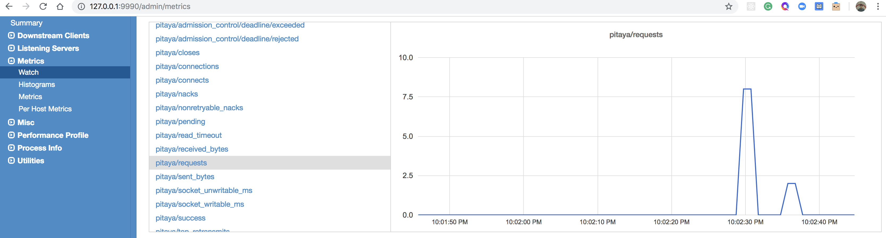

# pitaya-finch
REST API service for some Natural Language Processing **NLP** tasks. This service uses internally **Apache Open NLP** and provides an HTTP bridge (REST API) to use **NLP** stuff.

Pitaya service runs over **Finch** which allows you to create composable HTTP services definitions in a functional programming way making them elegant.

Finch endpoints are deployed on Finagle which already provides a super performance. In short: **We want to build tiny, elegant and efficient NLP services.**

# Contents
1) [How to run](#how-to-run)
1) [How to run in Docker](#how-to-run-in-docker)
1) [How to test](#how-to-test)
1) [API definition](#api-definition)


# How to run in local
This project uses Twitter-Server to wrap the entire service and provide useful tools for monitoring. When runing the project you can _admin_ your service through: `http://<domain>:9990`
```shell
$ sbt compile
$ sbt run
```

# How to run in Docker
Docker image is created with *SBT Native Packager*.

You just need to run:
```shell script
$ sbt docker:publishLocal
>
[info] Successfully tagged pitaya-finch:0.1.0
[info] Built image pitaya-finch with tags [0.1.0]
```

Then verify the image was created:
```shell script
$ docker image ls
>
REPOSITORY          TAG                 IMAGE ID            CREATED             SIZE
pitaya-finch        0.1.0               a17a221ee435        2 minutes ago       130MB
<none>              <none>              22c83e7018ca        2 minutes ago       177MB
openjdk             jre-alpine          ccfb0c83b2fe        14 months ago       83MB
```

Run the Docker container:
```shell script
$ docker run --rm -p 80:8080 90:9990 pitaya-finch:0.1.0
>
[2019/09/19 21:27:11.622 GMT - main] INFO com.twitter.util.logging.Slf4jBridgeUtility$.info - org.slf4j.bridge.SLF4JBridgeHandler installed.
[2019/09/19 21:27:12.701 GMT - main] INFO com.twitter.finagle.http.HttpMuxer$.$anonfun$new$1 - HttpMuxer[/admin/metrics.json] = com.twitter.finagle.stats.MetricsExporter(com.twitter.finagle.stats.MetricsExporter)
[2019/09/19 21:27:12.703 GMT - main] INFO com.twitter.finagle.http.HttpMuxer$.$anonfun$new$1 - HttpMuxer[/admin/per_host_metrics.json] = com.twitter.finagle.stats.HostMetricsExporter(com.twitter.finagle.stats.HostMetricsExporter)
[2019/09/19 21:27:13.275 GMT - main] INFO org.juanitodread.pitayafinch.App$.startServer - Serving admin http on 0.0.0.0/0.0.0.0:9990
[2019/09/19 21:27:14.169 GMT - main] INFO com.twitter.finagle.$anonfun$once$1 - Finagle version 19.2.0 (rev=7576e54f801ef5b74dc86ca50b365fbe0de780d9) built at 20190221-122249
[2019/09/19 21:27:14.453 GMT - main] INFO org.juanitodread.pitayafinch.App$.info - Service starting at http://127.0.0.1:8080/pitaya 
```

* The API will be listening at port: 80
* The admin console will be listening at port: 90

## Stats console



# How to test
To run all the test suite
```shell
$ sbt test
```

To run a specific test case
```shell
$ sbt testOnly *<class-spec-name>
```


# API definition
* **General**
  1. [Current version](#current-version)
  1. [Schema](#schema)
  1. [Root endpoint](#root-endpoint)
* **NLP**
  1. [Token processing](#token-processing)
      1. [Tokenizer](#tokenizer)
          1. [Get token algorithms](#get-token-algorithms)
          1. [Tokenize text](#tokenize-text)
      1. [Normalizer](#normalizer)
          1. [Lowercase converter](#lowercase-converter)
          1. [Stopwords remover](#stopwords-remover)
          1. [Stemmer](#stemmer)
          1. [Lemmatizer](#lemmatizer)
      1. [Pipeline: Token processing pipeline](#pipeline-token-processing-pipeline)
  1. [Sentence Detector](#sentence-detector)
      1. [Find sentences](#find-sentences)
  1. [Entity Recognition](#entity-recognition)
      1. [Entities](#entities)
  
  
## General
### Current version
The current version of this API is **v1**.
 
### Schema
All data is sent and received as **JSON**.
 
### Root endpoint
The root endpoint is: `http://<host>:<port>/pitaya/api/v1/`
 
 
## NLP
### Token processing
#### Tokenizer
##### Get token algorithms
Returns a list of supported tokenizer algorithms.

```
GET /nlp/tokenizer
```

###### Parameters
N/A

###### Response
```javascript
Status: 200 OK
```
```javascript
[
    "SIMPLE",
    "WHITESPACE",
    "MAX_ENTROPY"
]
```

##### Tokenize text
Returns a list of tokens of the provided text using the specified algorithm.
 
```
POST /nlp/tokenizer
```
 
###### Parameters (Body)

| Name | Type | Description |
| --------- | -------- | ---- |
| `text` | `string` | The text to be split in tokens. |
| `algorithm` | `enum` | The tokenizer algorithm to be used. **Values:** `SIMPLE`, `WHITESPACE`, `MAX_ENTROPY`|
 
###### Response
```javascript
Status: 200 OK
```
```javascript
{
    "text": "Thi's is a sample.",
    "algorithm": "WHITESPACE",
    "tokens": [
        "Thi's",
        "is",
        "a",
        "sample."
    ]
}
```
 
 
#### Normalizer
##### Lowercase converter
Returns a list of tokens in lower case format.
 
```
POST /nlp/normalizer/lowercase
```
 
###### Parameters (Body)

| Name | Type | Description |
| --------- | -------- | ---- |
| `tokens` | `array[String]` | The list of tokens to be lower cased. |
 
###### Response
```javascript
Status: 200 OK
```
```javascript
{
    "tokens": [
        "ThIs",
        "requires",
        "TO",
        "BE",
        "lOwErCasED"
    ],
    "result": [
        "this",
        "requires",
        "to",
        "be",
        "lowercased"
    ]
}
```

 
##### Stopwords remover
Returns a list of tokens without stopwords. Stopwords works for English.
 
```
POST /nlp/normalizer/stopwords
```
 
###### Parameters (Body)

| Name | Type | Description |
| --------- | -------- | ---- |
| `tokens` | `array[String]` | The list of tokens to remove stopwords. |
 
###### Response
```javascript
Status: 200 OK
```
```javascript
{
    "tokens": [
        "this",
        "requires",
        "to",
        "be",
        "lowercased"
    ],
    "result": [
        "requires",
        "lowercased"
    ]
}
```

 
##### Stemmer
Returns a list of pairs with the word and their respective Stem. Stemmer works for English.
 
```
POST /nlp/normalizer/stem
```
 
###### Parameters (Body)

| Name | Type | Description |
| --------- | -------- | ---- |
| `tokens` | `array[String]` | The list of tokens to get their stem. |
 
###### Response
```javascript
Status: 200 OK
```
```javascript
{
    "tokens": [
        "banking",
        "bank",
        "banked",
        "became",
        "become"
    ],
    "result": [
        {"orginal": "banking", "stem": "bank"},
        {"orginal": "bank", "stem": "bank"},
        {"orginal": "banked", "stem": "bank"},
        {"orginal": "became", "stem": "becom"},
        {"orginal": "become", "stem": "becom"}
    ]
}
```

 
##### Lemmatizer
Returns a list of pairs with the word and their respective Lemmas. Lemmatizer works for English.
 
```
POST /nlp/normalizer/lemma
```
 
###### Parameters (Body)

| Name | Type | Description |
| --------- | -------- | ---- |
| `tokens` | `array[String]` | The list of tokens to get their lemmas. |
 
###### Response
```javascript
Status: 200 OK
```
```javascript
{
    "tokens": [
        "bob",
        "hello"
    ],
    "result": [
        {
            "original": "bob",
            "lemmas": [
                {"tag": "NNS", "description": "Noun, plural"},
                {"tag": "NN", "description": "Noun, singular or mass"},
                {"tag": "VB", "description": "Verb, base form"},
                {"tag": "VBP", "description": "Verb, non-3rd person singular present"}
            ]
        },
        {
            "original": "hello",
            "lemmas": [
                {"tag": "NN", "description": "Noun, singular or mass"}
            ]
        }
    ]
}
```

 
#### Pipeline: Token processing pipeline
Process the provided text using the specified algorithms in the sequence defined by the Pipeline object.

A Pipeline object has three main components or steps:

* **init:** Is the first stage of the Pipeline. The *type* of this stage is `String => List[String]`. We only support `Tokenizer` algorithm for **init** stage.
* **stages:** Is a list of *stage* (algorithms) which will be applied to the result of the previous stage. The *type* of this stage is `List[String] => List[String]`.
* **finalizer:** Is the last stage of the Pipeline. The *type* of this stage is `List[String] => Result`.

| Stage     | Algorithms | Description |
| --------- | ---------- | ----------- |
| `init` | `TOKENIZER` | The text to be split in tokens. |
| `stage` | `LOWERCASE`, `STOPWORDS` | Tokens to be processed and the result is a list of tokens. |
| `finalizer` | `STEMMER`, `LEMMATIZER` | The list of tokens to be processed by a final stage which produces a *Result*. |
 
```
POST /nlp/pipeline
```
 
###### Parameters (Body)

| Name | Type | Description |
| --------- | -------- | ---- |
| `text` | `string` | The text to be split in tokens. |
| `pipeline` | `object` | The pipeline definition. |
| `pipeline.init` | `object` | The first stage of the pipeline processing. |
| `pipeline.stages` | `array[object]` | A list of stage objects. |
| `pipeline.finalizer` | `object` | The last stage of the pipeline processing. This stage must return a result. |

###### Example
```javascript
{
    "text": "Hello World",
    "pipeline": {
        "init": { "algorithm": "TOKENIZER", "strategy": "MAX_ENTROPY" },
        "stages": [
            { "algorithm": "LOWERCASE" },
            { "algorithm": "STOPWORDS" }
        ],
        "finalizer": { "algorithm": "STEMMER" }
    }
}
```
 
###### Response
```javascript
Status: 200 OK
```
```javascript
{
    "pipeline": "Tokenizer -> LowerCaseConverter -> StopWordsRemover -> Stemmer",
    "stemmerResult": [
        {
            "original": "hello",
            "stem": "hello"
        },
        {
            "original": "world",
            "stem": "world"
        }
    ]
}
```

**Note:** If the finalizer is `LEMMATIZER` algorithm, the *Result* property will be `lemmaResult`


### Sentence Detector
#### Find sentences
Returns a list of sentences according to the given text (paragraph).
 
```
POST /nlp/sentences/find
```
 
###### Parameters (Body)

| Name | Type | Description |
| --------- | -------- | ---- |
| `text` | `string` | The text to be split into sentences. |
 
###### Response
```javascript
Status: 200 OK
```
```javascript
{
    "text": "Thi's is a sample. This is another one. Hi",
    "sentences": [
        { "sentence": "Thi's is a sample.", "confidence": 1.0 },
        { "sentence": "This is another one.", "confidence": 0.994 },
        { "sentence": "Hi", "confidence": 1.0 }
    ]
}
```


### Entity Recognition
#### Entities
Returns a list of entities found in the given text (sentence). The algorithm supports the following entity types:

* Dates
* Times
* Locations
* Persons
* Organizations
* Money
* Percentages

all of them are used in the process.

```
POST /nlp/entities
```
 
###### Parameters (Body)

| Name | Type | Description |
| --------- | -------- | ---- |
| `text` | `string` | The text to analyzed in order to detect entities. |
 
###### Response
```javascript
Status: 200 OK
```
```javascript
{
    "text": "He appointed Julian Casablancas or John Doe",
    "entities": [
        { "entity": "Julian Casablancas", "model": "Person", "confidence": 0.949 },
        { "entity": "John Doe", "model": "Person", "confidence": 0.913 }
    ]
}
```
